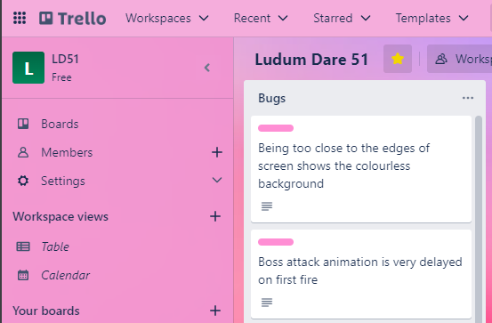
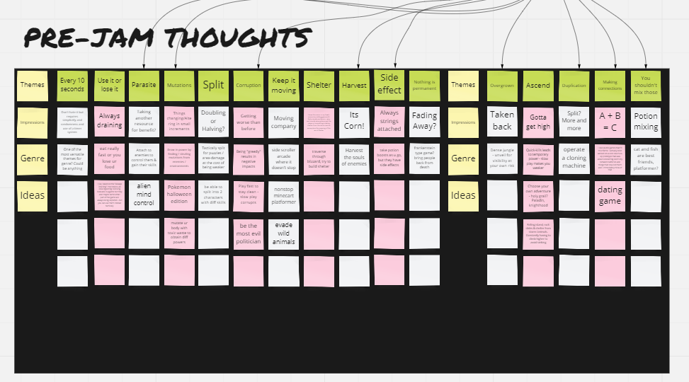
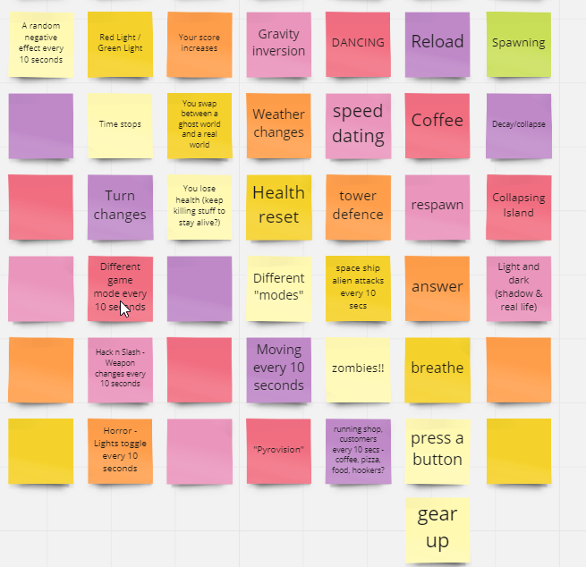
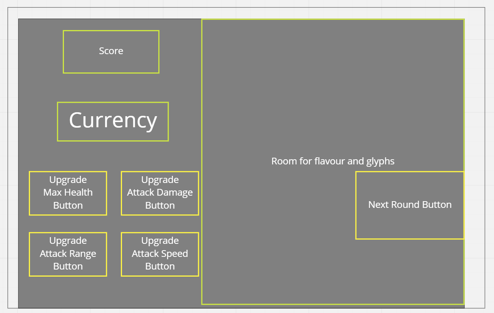
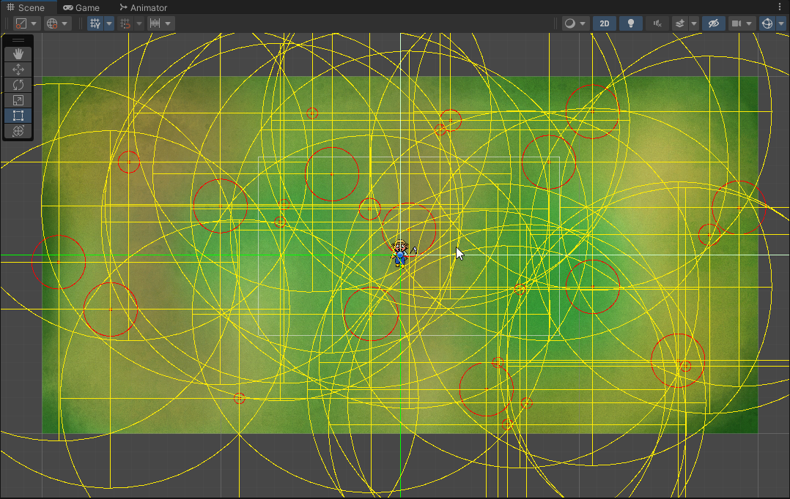
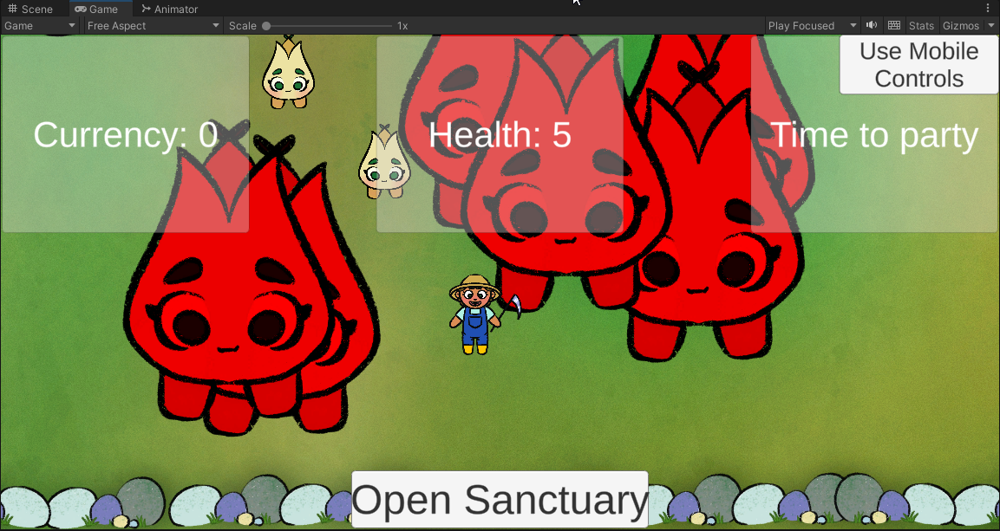
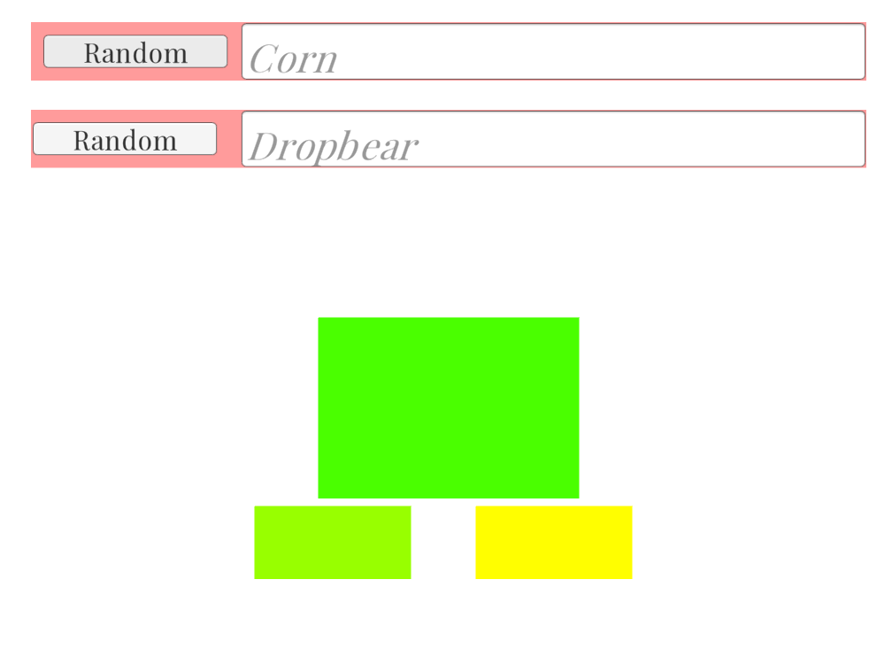
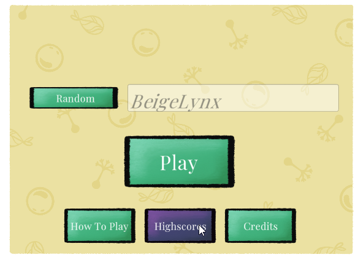

## Background
One autumn weekend just a few weeks ago, I produced a game. And not just any game, but maybe the most ambitious game jam game so far. Long story short, it went quite well. 
But it also was not without its share of successes, and failures, along the way.

I have been a part of the previous 5 ludum dare game jams. Every time we get involved, our team grows bolder, and sometimes bigger. Well, this time was not our biggest, but it certainly was our boldest.
Even just at the tail end of ludum dare 50 back in April, I already knew exactly where I wanted to improve and optimise the experience. 

For the previous two jams before this one, I had organised, and facilitated everything. From getting the people together, to streamlining the decision-making process (another long story), and
continuously making sure we were culling just the right number of features each successive hour to ensure we finished in time. I knew years ago that I wanted to produce video games, and what better experience
could I get (short of working in the field), than producing one right here, in just a weekend.

Producing even a game jam proved to be a monumental task. I mean, it's super fun, but always huge. This is partially due to the timezone differences between the entire team, plus the different levels of motivation and experience. Creating a game in 72 hours is not easy.

## Preparation
*"It's Corn"*

In the few weeks leading up to the event, things become to take shape. I have a lot to organise and keep track of to make sure that I, and everyone who volunteers their weekends to such a good cause,
has the best possible experience. 

The To-Do list looked something like:
- **Check in with anyone who was previously involved, and see if they want to be involved again.** This is more difficult than you might think, so it often involves reaching out to everyone individually fairly well in advance.
- **Scope out potential candidates for newbies to get involved.** This is super important to me - I want more people to experience the joys of creating something so quickly and in such a casual but exciting way, and I also want to give people the opportunity to do what I did - coming from a place of virtually no experience and making something they can be forever proud of.
- **Plan the tech stack we will use.** This time, a good friend and I decided we wanted to go deeper on the scoring side of the games, due to having a local only high scores system in ld50. So this involved researching, and putting together a fully functional but simplistic web server that could handle simple database management and high score saving/loading for global high scores. Shout out to James for his amazingly hard work getting things up and running.
- **Prepare the planning tools.** Well, this wasn't so hard but involved preparing a collaborative whiteboard and a trello board for task management, making sure everyone had access to it, getting the team verified together on ldjam.com, setting up the discord server and channels for the weekend and so on.
- **Check in once again with each member about schedules** and rough manpower evaluations a week before the event.
- **Make sure all my meals and food was planned** and my fridge was full of energy drinks and milk for coffee.

For this event, we also had an amazing artist who had always wanted to get involved with making a game but never had the opportunity. An avid gamer, but first time game artist, she was brilliant, but also we did some preparation work there to make sure all the right pieces were in place for that (including asset folders, content management and so on).

We also developed an unholy obsession with the "[it's corn](https://www.youtube.com/watch?v=_caMQpiwiaU)" kid and the song that came from that. I don't know why, we just did. More on how that entered the game later.

Oh, and a particular focus this jam was on mobile playability. So that influenced a lot of UI/UX and design choices (lots of new learnings here too).

## Jam time - Day one
The weekend came around super quickly, and the week of voting ended with the announcement of the theme at 1am in my timezone.

**"Every 10 seconds"**

_Sigh_. It was about everyone's least favourite of the possible themes. But we immediately got cracking into our Miro whiteboard and brainstormed for 30 minutes.

Eventually we put our pens down and started chatting - eventually diving deep into the idea of a forest that changes between day and night, and this occurs every 10 seconds.
We already had considered the possibility of a rogue lite / hack 'n slash style game so merging that idea with the target genre was not so difficult…

Then we got to work.

#### Me, myself and 3am production mode

A huge part of my role on day one was about making sure we were making significant progress, and that everyone had tasks to do at all times.
Of course, this is not a job, people could come and go as they pleased - but everyone knows the first 12 hours are the most vital and also about the most significant. Maybe not the most fun though.

I felt during this whole procedure while preparing scenes, assets, tasks and making sure everyone was firing on all cylinders, that I had failed.
There was never a dull moment for me, but I would have loved to have been able to get our newbie quickly on the board with a task. I struggled here though, and I really let them down.

I also would love to have been able to go one by one through everyone cyclically (there was seven of us in total) and make sure everyone knew what they wanted to do. I spent a lot of my time ensuring that our
ideas and early developments were all lining up, and not enough time on ensuring that everyone was equally able to contribute. 

It might be less that I failed, and more that I learnt a lot from this first few hours. 
I'll come back to reflecting deeper on this in another blog post.

I went to sleep at around 5.30am and let the team do what they do best.

## The rest of the development

I won't go into a lot of detail for the rest of the jam process, but I will share some highlights, snapshots and progress, in a sort of montage-y fashion.

<figure class="gatsby-resp-image-figure" style=""><figcaption class="gatsby-resp-image-figcaption">
The very first progress gif we took
</figcaption></figure>

<figure class="gatsby-resp-image-figure" style=""><figcaption class="gatsby-resp-image-figcaption">
... and it's first implementation
</figcaption></figure>

Getting the mobile stuff ready was the job of our talented developer Bray, who also handled some of the more advanced stuff, like the lighting and enemy logic in the project.

<figure class="gatsby-resp-image-figure" style=""><figcaption class="gatsby-resp-image-figcaption">
Adding basic animations, some mobile joysticks and testing the size and layout
</figcaption></figure>

Meanwhile, James who handled most of the high scores and design elements around that part, put together a name generator. Fun!

At this point, we moved onto crunch mode - we were over halfway through the jam, most of the art assets were coming in thick and fast and it was time to get down to business.
It's about this time that I start rolling up my sleeves and going in. I had to brutally cull a lot of things that people wanted, and manage some challenges we faced at this point.

#### Notable challenges

1. We figured out about halfway through the jam, once we had received a first pass of nearly all art assets, that we were looking at the character too far from the side from our original idea. Well, for some people's original ideas. We initially had envisioned a very top down feel, but we had to scope and redesign with the approach. This was mostly my fault - communications between different "departments" as such was my job. So managing expectations and reality checking the people who wanted these changes was up to me. It was far too late to expect any asset redesign.
2. Solving issues with the WebGL builds for mobile accessibility was an absolute mission. It would almost be less work (learnt post jam) to just publish a rubbish and buggy apk on the play store, since the Android builds were always going to run nicer than a webgl build on a mobile phone... Lesson learnt.
3. Adding new features that we had planned late in the jam session is never a good idea. Everyone knows this - even me, who had culled about 10 things already. But it was vital we had one particular element which was essentially required to make the game fun, done. This was a core feature for our game, and we left it much too late... That feature was the boss.

## Jam wrap up

A couple of the others who had not yet been too worn out to keep going, and I, went into extreme crunch mode in the final 12 hours of the jam. This included some speed 
adding of the boss system, UI tidy up, wave to wave systems, properly scoring mechanics, game design tuning, and more. I could go on but if you're still reading, you're probably getting bored now.

Here are some images to show the last few elements coming together.

A massive shout-out to Tomas and Tanya for making the critters look this damn good. Look at the creepy one jump!

<figure class="gatsby-resp-image-figure" style=""><figcaption class="gatsby-resp-image-figcaption">
Enemy animations in gameplay mode
</figcaption></figure>

<figure class="gatsby-resp-image-figure" style=""><figcaption class="gatsby-resp-image-figcaption">
The night and day final pass ('turned up to 11 to show it off')
</figcaption></figure>

And the gorgeous king himself, The Colonel.

<figure class="gatsby-resp-image-figure" style=""><figcaption class="gatsby-resp-image-figcaption">
The Colonel in all his glory finally implemented in game
</figcaption></figure>

So 100 branches and pull requests, 72 hours, and maybe 15 energy drinks (each) later, we made it to the end.

## So how did we do?

Let's just say this jam post is very long, not super detailed or technical, and mostly put here to showcase the hard work everyone else put into the game while I tried to keep things
from falling off a cliff. Did I succeed? well - the game is done, and most of us are happy with it - but you'll have to read part two to see:

- How did we do in the landscape of ludum dare?
- How did I do, particularly looking at the production elements?
- What went well and what can I do better next time?

Moikka!