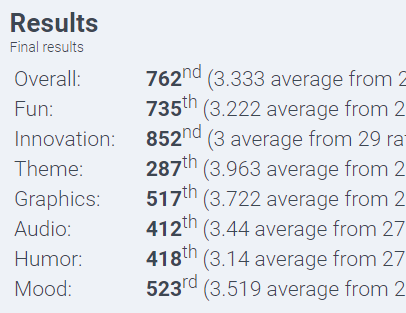

**WRITING IN PROGRESS**

## The story so far
We made a game in 72 hours. So what? (If you didn't yet read part one, <a href="https://baconeta.com/ldjam-51-reflection/">click here</a> to check out the process of getting to this stage).

Once the jam ends, it's not the end of the story. It now is up to the participants involved from all over the world, to rate, critique and experience everyone
else's games. 

I think I should start there.

## So, how did we do?

After all was said and done, the ratings came out and the results were in. But before we get to that, the hardest and also most important part of the entire process
was the feedback. I have put a summary of the most common feedback we got here:

**TO ADD**

And the results, posted about 3 weeks later, came in as below.

